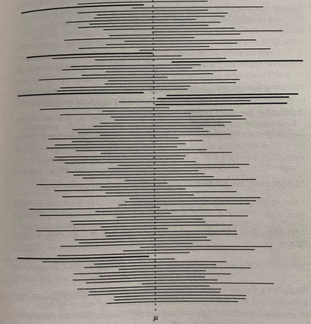

```{r setup, include=FALSE}
knitr::opts_chunk$set(echo = FALSE)
```

**confidence interval (interval estimate)** An $\alpha$% confidence interval for an unknown \*population \*parameter $\theta$, say, is an interval, calculated from \*sample values by a procedure such that if a large number of \*independent samples is taken, $\alpha$% of the intervals obtained will contain $\theta$. The term 'confidence interval' was introduced in 1934 by \*Neyman.

A confidence interval can also be thought of as a single \*observation of a random interval, calculated from a random sample by a given procedure, such that the \*probability that the interval contains $\theta$ is $\alpha$%. For example, if $X_1, X_2, \ldots, X_n$ is a random sample from a \*normal distribution with unknown \*mean $\mu$ and known \*variance $\sigma^2$, and writing $\bar{X} = (X_1 + X_2 + \cdots + X_n)/n$,

$$\text{P}\left(-1.96\frac{\sigma}{\sqrt{n}} < \bar{X} - \mu < 1.96\frac{\sigma}{\sqrt{n}}\right) = 0.95,$$

so

$$\text{P}\left(\bar{X} - 1.96\frac{\sigma}{\sqrt{n}} < \mu < \bar{X} + 1.96\frac{\sigma}{\sqrt{n}}\right) = 0.95\%.$$

Hence, if $\bar{x}$ is the observed value of the sample mean, the end points of the corresponding 95% confidence interval for the mean, $\mu$, are $\bar{x} \pm 1.96\sigma/\sqrt{n}$. This is a **symmetric confidence interval**. It is possible to have a **one-sided confidence interval**. For example $\mu > \bar{x} - 1.645\,\sigma/\sqrt{n}$ is a one-sided 95% confidence interval for the mean, $\mu$.

If the population variance is not known then, to find a confidence interval for the mean, the $t$-distribution can be used and the end points of the 95% confidence interval for the mean are

$$\bar{x} \pm t_{n-1}(0.025)\frac{s}{\sqrt{n}}.$$


```{r, echo=FALSE, fig.cap="**Confidence interval.** The illustration shows one hundred 95% confidence intervals for the population mean. Each confidence interval is derived from a random sample from the same distribution. The intervals differ in width and location because of variations in the sample means and variances. On average 95% of such confidence intervals will include the true value of the population mean ."}

```


where $t_{n-1}(0.025)$ is the \*critical value corresponding to an upper-tail probability of 2.5% for a $t$-distribution with $(n-1)$ \*degrees of freedom, and $s$ is the unbiased estimate of the population variance based on the sample values.

In the case when the population is not known to be normal the \*central limit theorem may be used, provided $n$ is reasonably large, to give the values $\bar{x} \pm 1.96\,s/\sqrt{n}$ as an approximate symmetric 95% confidence interval for $\mu$.

Finding a confidence interval for a population \*proportion is difficult, owing to the discrete nature of the \*binomial distribution, unless the \*sample size $n$ is large enough for the normal approximation to the binomial distribution to be valid. In this case the ends of the $\alpha$% symmetric confidence interval for the population proportion are the values $p$ such that

$$p = \hat{p} \pm K\sqrt{\frac{p(1-p)}{n}},$$

where $\hat{p}$ is the sample proportion and $K$ is the critical value corresponding to an upper-tail probability of $\frac{1}{2}(100 - \alpha)$% for a standard normal distribution. *See also* CLOPPER-PEARSON METHODS.

Equivalently, the $\alpha$% confidence limits are the roots of the quadratic equation

$$p^2\left(1 + \frac{K^2}{n}\right) - p\left(2\hat{p} + \frac{K^2}{n}\right) + \hat{p}^2 = 0.$$

An often used, but not recommended, approximate formula is

$$p = \hat{p} \pm K\sqrt{\frac{\hat{p}(1-\hat{p})}{n}}.$$

Since $\hat{p}(1-\hat{p}) \approx \frac{1}{4}$ for values of $\hat{p}$ not too close to 0 or 1, an even simpler form is

$$p = \hat{p} \pm K\frac{1}{2\sqrt{n}}.$$

Hence for a sample of size 1000 the 90% confidence limits are approximated by $p = \hat{p} \pm 0.03$, which is possibly the source of the oft-repeated statement that estimates of percentages from an opinion poll have a possible error of $\pm 3$%.

A confidence interval for a \*population variance $\sigma^2$ can be found, under the assumption that the population is normal. If $s^2$ is the unbiased estimate of the population variance, based on a sample of size $n$, then the $\alpha$% confidence for $\sigma^2$ is given by $$\frac{(n-1)s^2}{U} < \sigma^2 < \frac{(n-1)s^2}{L},$$

where $L$ is the critical value corresponding to a lower-tail probability of $\frac{1}{2}(100 - \alpha)$%, for a \*chi-squared distribution with $(n-1)$ degrees of freedom, and $U$ is the critical value corresponding to an upper-tail probability of the same size.

