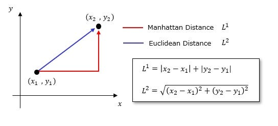

```{r setup, include=FALSE}
knitr::opts_chunk$set(echo = FALSE)
```

A measure of the distance between points in multidimensional space (also called a **metric**). Distance measures are used with techniques such as *cluster analysis and *multidimensional scaling. The two measures most commonly used are Euclidean distance and the city-block metric.

**Euclidean distance** is the straight-line distance between two points. In $d$ dimensions, if the positions of $P$ and $Q$ are given by the coordinates $(p_1, p_2, \ldots, p_d)$ and $(q_1, q_2, \ldots, q_d)$ then the Euclidean distance between $P$ and $Q$ is given by

$$\sqrt{\sum_{j=1}^{d}(p_j - q_j)^2}.$$

The **city-block metric** in two dimensions measures the distance between two points in a city if, for example, the only directions in which one could travel were north-south and east-west. It is also called the **Manhattan distance**. In $d$ dimensions the city-block distance between $P$ and $Q$ is given by

$$\sum_{j=1}^{d}|p_j - q_j|.$$

A generalization of the previous measures is the **Minkowski distance**

$$\left\{\sum_{j=1}^{d}|p_j - q_j|^k\right\}^{\frac{1}{k}},$$

where $k$ is a positive integer. Euclidean distance is the Minkowski distance of order 2, and Manhattan distance is the Minkowski distance of order 1.

The **Chebyshev distance** is the largest difference over the $d$ dimensions

$$\max_{j=1}^{d} |p_j - q_j|.$$

Two other measures that have been proposed are the **Canberra distance**, given by

$$\sum_{j=1}^{d} \left\{ \frac{|p_j - q_j|}{|p_j| + |q_j|} \right\},$$

and, in the context of counts of organisms, the **Bray-Curtis distance** (also called the **Sorensen distance**):

$$\frac{\sum_{j=1}^{d} |p_j - q_j|}{\sum_{j=1}^{d} (p_j + q_j)}.$$
```{r, echo=FALSE, fig.cap="**Distance measure.** These are the two simplest of an infinite number of possible measures of distance"}

```

The **Chebyshev distance** is the largest difference over the $d$ dimensions

$$\max_{j=1}^{d} |p_j - q_j|.$$

Two other measures that have been proposed are the **Canberra distance**, given by

$$\sum_{j=1}^{d} \left\{ \frac{|p_j - q_j|}{|p_j| + |q_j|} \right\},$$

and, in the context of counts of organisms, the **Bray-Curtis distance** (also called the **Sorensen distance**):

$$\frac{\sum_{j=1}^{d} |p_j - q_j|}{\sum_{j=1}^{d} (p_j + q_j)}.$$