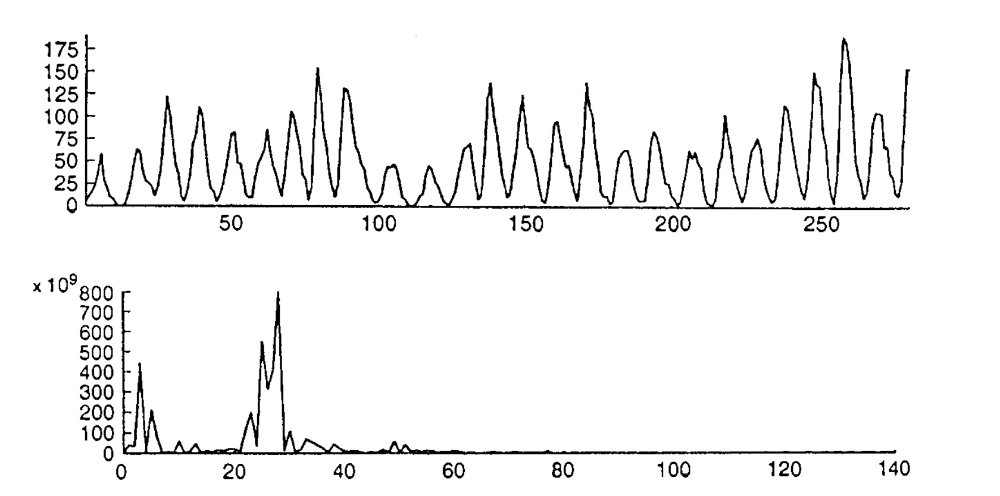

```{r setup, include=FALSE}
knitr::opts_chunk$set(echo = FALSE)
```
A method of determining the period of the cyclical term $S_t$ in a *time series* of the form

$$X_t = S_t + \epsilon_t$$

where $\epsilon_t$ represents the random fluctuations of the series about $S_t$. The cyclical term is
represented as a sum of sine and cosine terms so that $X_t$ becomes

$$X_t = \sum_i (A_i \cos \omega_i t + B_i \sin \omega_i t) + \epsilon_t$$

For certain series the periodicity of the cyclical component can be specified very accu-
rately, as, for example, in the case of economic or geophysical series which contain a strict
12-month cycle. In such cases, the coefficients $\{A_i\}$, $\{B_i\}$ can be estimated by regression
techniques. For many series, however, there may be several periodic terms present with
unknown periods and so not only the coefficients $\{A_i\}$, $\{B_i\}$ have to be estimated but
also the unknown frequencies $\{\omega_i\}$. The so-called *hidden periodicities* can often be
determined by examination of the *periodogram* which is a plot of $I(\omega)$ against $\omega$ where

$$I(\omega) = \frac{2}{N} \left\{ \left[ \sum_{i=1}^{N} X_t \cos(\omega t) \right]^2 + \left[ \sum_{i=1}^{N} X_t \sin(\omega t) \right]^2 \right\}$$

and $\omega = 2\pi p/N$, $p = 1, 2, \ldots, [N/2]$; $N$ is the length of the series. Large ordinates on this plot indicate the presence of a cyclical component at a particular frequency. As an
example of the application of this procedure Fig.1 shows the sunspot series and the 



periodogram of this series based on 281 observations. It is clear that the ordinate at
$\omega = 2\pi \times 28/281$, corresponding to a period of approximately 10 years, is appreciably
larger than the other ordinates. If several peaks are observed in the periodogram it
cannot be concluded that each of these corresponds to a genuine periodic component in
$X_t$ since it is possible that peaks may occur due simply to random fluctuations in the noise
term $\epsilon_t$. Various procedures for formally assessing periodic ordinates are available of
which the most commonly used are *Schuster's test*, *Walker's test* and *Fisher's g statistic*.
