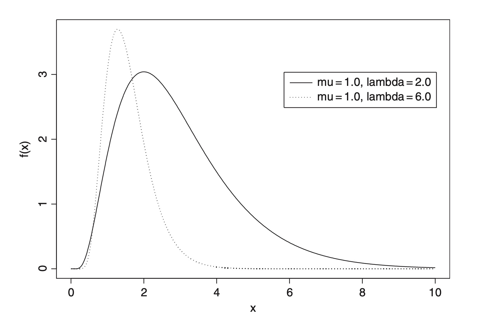

```{r setup, include=FALSE}
knitr::opts_chunk$set(echo = FALSE)
```

Functions useful for modelling many *dose–response* relationships in biology. For a particular dose or stimulus $x$, the expected value of the response variable, $y$, is defined by

$$E(y) = \frac{x + \alpha}{\sum_{i=0}^{d} \beta_i (x + \alpha)^i} \quad x \geq 0$$

The parameters, $\beta_1, \beta_2, \ldots, \beta_d$, define the shape of the dose–response curve and $\alpha$ defines its
position on the $x$ axis. A particularly useful form of the function is obtained by setting $\alpha = 0$
and $d = 1$. The resulting curve is

$$E(y) = \frac{x}{\beta_0 + \beta_1 x} \quad x \geq 0$$

which can be rewritten as

$$E(y) = \frac{k_1 x}{k_2 + x}$$

where $k_1 = 1/\beta_1$ and $k_2 = \beta_0/\beta_1$. This final equation is equivalent to the *Michaelis–Menten* equation. 

<center>

</center>