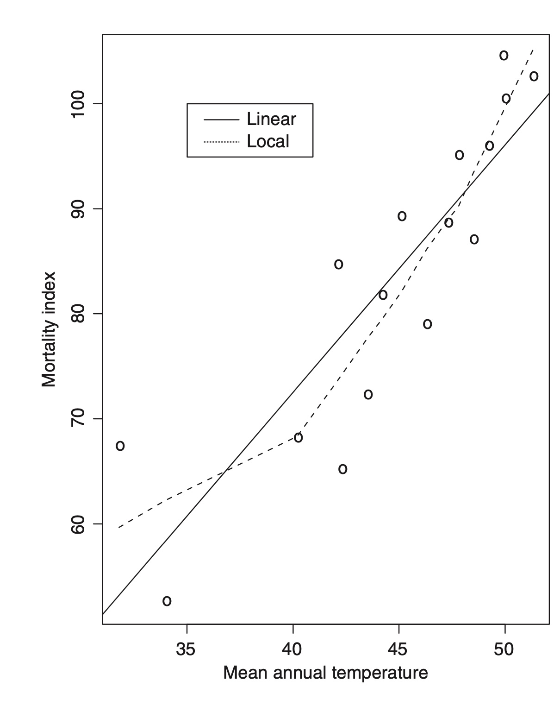

```{r setup, include=FALSE}
knitr::opts_chunk$set(echo = FALSE)
```

A method of regression analysis in which polynomials of degree one (linear) or two (quadratic) are used to approximate the regression function in particular ‘neighbourhoods’ of the space of the explanatory variables. Often useful for smoothing scatter diagrams to allow any structure to be seen more clearly and for identifying possible non-linear relationships between the response and explanatory variables. A robust estimation procedure (usually known as loess) is used to guard against deviant points distorting the smoothed points. Essentially the process involves an adaptation of iteratively reweighted least squares. The example shown in Fig. 1 illustrates a situation in which the locally weighted regression differs considerably from the linear regression of y on x as fitted by least squares estimation. 


{width=70%}

