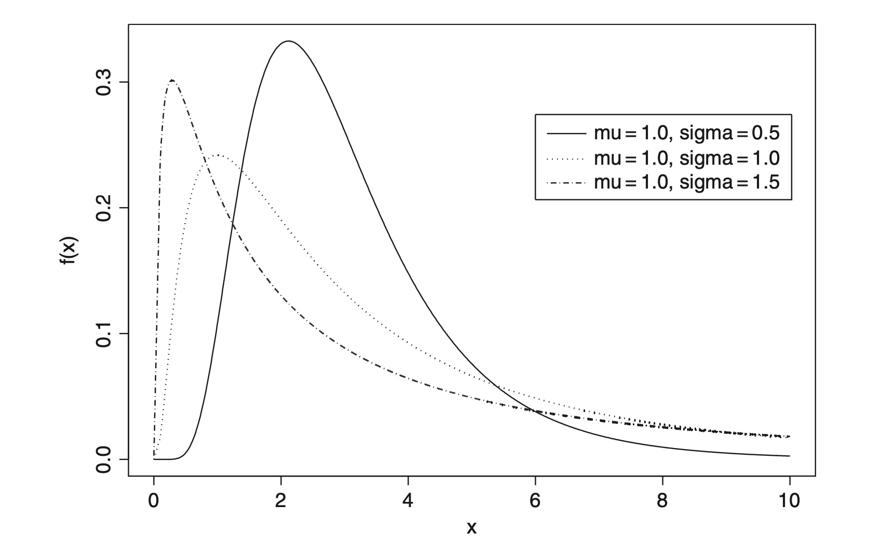

```{r setup, include=FALSE}
knitr::opts_chunk$set(echo = FALSE)
```

A test for comparing two or more sets of *survival times*, to assess the null hypothesis
that there is no difference in the survival experience of the individuals in the different groups.
For the two-group situation the *test statistic* is

$$U = \sum_{j=1}^{r} (d_{1j} - e_{1j})$$

where $d_{1j}$ is the number of deaths in the first group at $t_{(j)}$, the $j$th ordered death time,
$j = 1, 2, \ldots, r$, and $e_{1j}$ is the corresponding expected number of deaths given by

$$e_{1j} = n_{1j} d_j / n_j$$

where $d_j$ is the total number of deaths at time $t_{(j)}$, $n_j$ is the total number of individuals at risk at
this time, and $n_{1j}$ the number of individuals at risk in the first group. The expected value of $U$
is zero and its variance is given by

<center>

</center>

$$V = \sum_{j=1}^{r} n_j v_{1j}$$

where

$$v_{1j} = \frac{n_{1j} n_{2j} d_j (n_j - d_j)}{n_j^2 (n_j - 1)}$$

Consequently $U/\sqrt{V}$ can be referred to a standard normal distribution to assess the
hypothesis of interest. Other tests use the same test statistic with different values for the
weights. The *Tarone–Ware test*, for example, uses $w_j = \sqrt{n_j}$ and the *Peto-Prentice test* uses

$$w_j = \prod_{i=1}^{j} \frac{n_i - d_i + 1}{n_i + 1}$$


