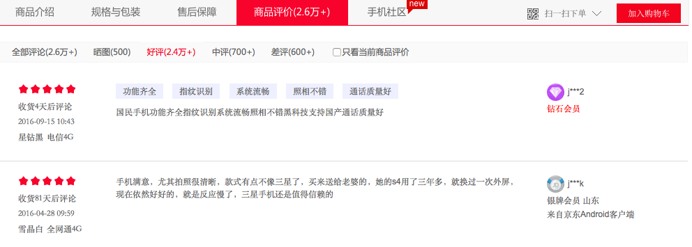

---
jupyter:
  jupytext:
    text_representation:
      extension: .Rmd
      format_name: rmarkdown
      format_version: '1.2'
      jupytext_version: 1.19.1
  kernelspec:
    display_name: Python 3 (ipykernel)
    language: python
    name: python3
---

```{r setup, include=FALSE}
library(reticulate)
use_python("/Users/Zhuanz/anaconda3/bin/python3.11", required = TRUE)
# or use your conda environment
use_condaenv("base", required = TRUE)
```

<!-- #region -->
In any industry, users' evaluation of products is particularly important. Through user comments, the user's emotional tendency can be determined. For example, the most common online shopping behaviour at present: for users, reference comments can make better purchasing decisions; for merchants, classifying commodity reviews according to emotional tendencies and obtaining commonly mentioned advantages and disadvantages of commodities through text clustering can further improve products. This case mainly discusses how to judge the emotional tendency of commodity reviews. The following picture shows the comments on a certain mobile phone on an e-commerce platform:



## 1 Data Source

This dataset contains product review information for a mobile phone, with 2 attributes and a total of 8187 samples.

| Column Name | Description | Type | Example |
|-------------|-------------|------|---------|
| Comment | Review of the mobile phone | String | The customer service is particularly irresponsible — I clearly left a note but they ignored it and sent the wrong item. |
| Class | Sentiment orientation of the review: <br> -1 ----- Negative <br> 0 ----- Neutral <br> 1 ------ Positive | Int | -1 |

Use the `read_excel` function in Pandas to read the `.xls` format dataset file. Note that the file encoding should be set to `gb18030`.


```{python}
import pandas as pd

#read in data set
data = pd.read_excel("dataset/data.xls")
data.head()
```

View the relevant information of the data set, including the number of columns, column names, and the number of samples of each category.

```{python}
# The size of the data set
data.shape
```

```{python}
# Column name of the data set
data.columns.values
```

```{python}
# Statistics of different categories of data records
data['Class'].value_counts()
```

### 2 Data preprocessing

Now, we need to convert the text information in the `Comment` column into a numerical matrix representation, that is, map the text to the feature space. First of all, through `jieba`, use the `HMM` model to divide the text into Chinese words.

```{python}
# Import Chinese sub-thesas jieba
import jieba
import numpy as np
```

```{python}
# The text of each sample of the data set is divided into Chinese words. If there is a missing value, use "It's okay, average" to fill it in.

cutted = []
for row in data.values:
    try:
        raw_words = (" ".join(jieba.cut(row[0])))
        cutted.append(raw_words)
    except AttributeError:
        print (row[0])
        cutted.append(u"还行 一般吧")

cutted_array = np.array(cutted)

# Generate a new data file, and the Comment field is the content after the word participle.
data_cutted = pd.DataFrame({
    'Comment': cutted_array,
    'Class': data['Class']
})
```

```{python}
data_cutted.head()
```

In order to observe words with high frequency more intuitively, we use the third-party library `wordcloud` to visualise the text.

```{python}
# Import third-party libraries wordcloud

from wordcloud import WordCloud
import matplotlib.pyplot as plt
```

For texts with good reviews, medium comments and bad reviews, establish `WordCloud` objects and draw word clouds.

```{python}
# High opinion
wc = WordCloud(font_path='/System/Library/Fonts/STHeiti Light.ttc')
wc.generate(' '.join(data_cutted['Comment'][data_cutted['Class'] == 1]))
plt.axis('off')
plt.imshow(wc)
plt.show()
```

```{python}
# Mid-comment

wc = WordCloud(font_path='/System/Library/Fonts/STHeiti Light.ttc')
wc.generate(''.join(data_cutted['Comment'][data_cutted['Class'] == 0]))
plt.axis('off')
plt.imshow(wc)
plt.show()
```

```{python}
# Bad comments

wc = WordCloud(font_path='/System/Library/Fonts/STHeiti Light.ttc')
wc.generate(''.join(data_cutted['Comment'][data_cutted['Class'] == -1]))
plt.axis('off')
plt.imshow(wc)
plt.show()
```

Judging from the word frequency statistics displayed by the word cloud, words such as "手机"，"就是"，"屏幕"，"收到" and so on are not helpful in distinguishing and will cause deviations. Therefore, it is necessary to filter out these meaningless words for district classification and put them in the disabled word file stopwords.txt.

```{python}
# Read the disabled word file
import codecs

with codecs.open('dataset/stopwords.txt', 'r', encoding='utf-8') as f:
    stopwords = [item.strip() for item in f]
    
for item in stopwords[0:200]:
    print (item,)
```

Use the extract_tags function of the jieba library to count the top 20 keywords in the positive, middle and bad reviews text.

```{python}
# Set the disabled word file, and filter the disabled words when counting keywords.
import jieba.analyse

jieba.analyse.set_stop_words('dataset/stopwords.txt') 
```

```{python}
# Positively praised keywords
keywords_pos = jieba.analyse.extract_tags(''.join(data_cutted['Comment'][data_cutted['Class'] == 1]), topK=20)
for item in keywords_pos:
    print (item,)
```

```{python}
# Key words in the middle of the evaluation
keywords_med = jieba.analyse.extract_tags(''.join(data_cutted['Comment'][data_cutted['Class'] == 0]), topK=20)
for item in keywords_med:
    print (item,)
```

```{python}
# Keywords of bad reviews
keywords_neg = jieba.analyse.extract_tags(''.join(data_cutted['Comment'][data_cutted['Class'] == -1]), topK=20)

for item in keywords_neg:
    print (item,)
```

After the above processing steps, the data preprocessing work for the entire dataset is "essentially complete". In Chinese text analysis and sentiment analysis tasks, the core of data preprocessing is word segmentation. Only after word segmentation can the text dataset proceed to the next step of vectorization, satisfying the input requirements of the model.

### 3. SVM-Based Sentiment Classification Model

The segmented text dataset must first be vectorized before it can be fed into the classification model for computation.

We use the `sklearn` library to implement the vectorization method, removing stopwords and mapping the text to the feature space via tf and tf-idf.

$$\text{tf-idf} = (1 + \log \text{tf}) \cdot \log \frac{N}{\text{df}}$$

Where **tf** is the term frequency, i.e. the number of times each term appears in the review after segmentation; **df** is the number of reviews containing that term; **N** is the total number of reviews. Logarithms are used to moderately suppress the influence of tf and df values.

| Vectorization Method | 0/1 Model | TF Model | TF-IDF Model |
|----------------------|-----------|----------|--------------|
| **Numeric Code**     | 0         | 1        | 2            |

We use functions from the `sklearn` library to directly implement the SVM algorithm. Here, we select the following SVM model types for computation.

| Classification Model | SVC | LinearSVC | SGDClassifier |
|----------------------|-----|-----------|---------------|
| **Numeric Code**     | 1   | 2         | 3             |

For convenience, we create a text sentiment analysis class `CommentClassifier` to implement the model building process:

- `__init__` is the class initialization function, taking parameters `classifier_type` and `vector_type`, representing the type of classification model and the type of vectorization method respectively.
- `fit()` function, to implement the process of vectorization and model building.

```{python}
# Realise the vectorisation method
from sklearn.feature_extraction.text import TfidfVectorizer
from sklearn.feature_extraction.text import CountVectorizer
# Realise svm models
from sklearn.svm import SVC
from sklearn.svm import LinearSVC
from sklearn.linear_model import SGDClassifier
# Realise cross-verification
from sklearn.model_selection import train_test_split
from sklearn.model_selection import cross_val_score
# Realise the evaluation indicators
from sklearn import metrics
```

```{python}
class CommentClassifier:
    def __init__(self, classifier_type, vector_type):
        self.classifier_type = classifier_type
        self.vector_type = vector_type

    def fit(self, train_x, train_y, max_df=0.98):
        list_text = list(train_x)
        # Vectorization method: 0 - 0/1, 1 - TF, 2 - TF-IDF
        if self.vector_type == 0:
            self.vectorizer = CountVectorizer(max_df=max_df, stop_words=stopwords, ngram_range=(1, 3)).fit(list_text)
        elif self.vector_type == 1:
            self.vectorizer = TfidfVectorizer(max_df=max_df, stop_words=stopwords, ngram_range=(1, 3), use_idf=False).fit(list_text)
        else:
            self.vectorizer = TfidfVectorizer(max_df=max_df, stop_words=stopwords, ngram_range=(1, 3), use_idf=True).fit(list_text)

        train_vec = self.vectorizer.transform(list_text)

        if self.classifier_type == 1:
            self.classifier = SVC()
        elif self.classifier_type == 2:
            self.classifier = LinearSVC()
        else:
            self.classifier = SGDClassifier()

        self.classifier.fit(train_vec, train_y)

    def predict_value(self, test_x):
        test_vec = self.vectorizer.transform(list(test_x))
        return self.classifier.predict(test_vec)

    def predict_proba(self, test_x):
        test_vec = self.vectorizer.transform(list(test_x))
        return self.classifier.predict_proba(test_vec)
```

- Use the train_test_split() function to divide the training set and the test set. Training set: 80%; Test set: 20%.

- Establish a list of values of two parameters, classifier_type and vector_type, to represent the selected vectorisation method and classification model.

- Output the classification evaluation results corresponding to the combination of each vectorisation method and classification model, including the confusion matrix and the scoring matrix with three indicators of Precision, Recall and F1-score.

```{python}
#Divide the training set and the test set
train_x, test_x, train_y, test_y = train_test_split(data_cutted['Comment'].ravel().astype('U'), data_cutted['Class'].ravel(),test_size=0.2, random_state=4)

classifier_list = [1,2,3]
vector_list = [0,1,2]

for classifier_type in classifier_list:
    for vector_type in vector_list:
        commentCls = CommentClassifier(classifier_type, vector_type)
        #max_df Set to 0.98
        commentCls.fit(train_x, train_y, 0.98)
        if classifier_type == 0:
            value_result = commentCls.predict_value(test_x)
            proba_result = commentCls.predict_proba(test_x)
            print (classifier_type,vector_type)
            print ('classification report')
            print (metrics.classification_report(test_y, value_result, labels=[-1, 0, 1]))
            print ('confusion matrix')
            print (metrics.confusion_matrix(test_y, value_result, labels=[-1, 0, 1]))
        else:
            value_result = commentCls.predict_value(test_x)
            print (classifier_type,vector_type)
            print ('classification report')
            print (metrics.classification_report(test_y, value_result, labels=[-1, 0, 1]))
            print ('confusion matrix')
            print (metrics.confusion_matrix(test_y, value_result, labels=[-1, 0, 1]))
```

Judging from the results, the tfidf vectorisation method is better to use the LinearSVC model. The f1-socre is 0.73.

Judging from the confusion matrix, we will find that most of the misclassifications appear in the middle and bad reviews. We can delete the middle comment of the original data set.

```{python}
data_bi = data_cutted[data_cutted['Class'] != 0]
data_bi['Class'].value_counts()
```

Run the classification model again to view the classification results.

```{python}
train_x, test_x, train_y, test_y = train_test_split(data_bi['Comment'].ravel().astype('U'), data_bi['Class'].ravel(),
                                                        test_size=0.2, random_state=4)

classifier_list = [1,2,3]
vector_list = [0,1,2]
for classifier_type in classifier_list:
    for vector_type in vector_list:
        commentCls = CommentClassifier(classifier_type, vector_type)
        commentCls.fit(train_x, train_y,0.98)
        if classifier_type == 0:
            value_result = commentCls.predict_value(test_x)
            proba_result = commentCls.predict_proba(test_x)
            print (classifier_type,vector_type)
            print ('classification report')
            print (metrics.classification_report(test_y, value_result, labels=[-1, 1]))
            print ('confusion matrix')
            print (metrics.confusion_matrix(test_y, value_result, labels=[-1, 1]))
        else:
            value_result = commentCls.predict_value(test_x)
            print (classifier_type,vector_type)
            print ('classification report')
            print (metrics.classification_report(test_y, value_result, labels=[-1, 1]))
            print ('confusion matrix')
            print (metrics.confusion_matrix(test_y, value_result, labels=[-1, 1]))
```

After deleting the bad reviews, the effect of the classification models of different combinations has been significantly improved. This also shows that the classification model can effectively distinguish between good reviews.

There is a problem of inaccurate labelling in the data set, which is mainly concentrated in the middle evaluation. Because when people comment, unless there is a problem, they will generally give good reviews. If they are dissatisfied with the product, they will tend to be negative in the expression of emotions. At the same time, the comments are very subjective. Many middle reviews will classify them as bad reviews, but in the data collection, they are considered to be medium reviews. Therefore, it is not objective enough to classify a comment into good reviews, middle reviews and bad reviews. The boundary between middle reviews and bad reviews is very blurred, so it is difficult to improve the recognition rate.

### 4. Unsupervised classification model based on doc2vec in word2vec

Word2vec, an open-source text vectorisation tool, can seek deeper feature representation for text data. Operations can be carried out between words:

w2v(woman)-w2v(man)+w2v(king)=w2v(queen)

Doc2vec, based on word2vec, represents each document as a vector, and the degree of similarity between the two documents can be calculated through the cosine distance, so the distance between a sentence and a sentence of excellent praise, and the distance from a sentence to a very bad review can be calculated.

In the data set of this case:

- 好评：快 就是 手感 满意 也好 喜欢 也 流畅 很 服务态度 实用 超快 挺快 用着 速度 礼品 也不错 非常好 挺好 感觉 才来 还行 好看 也快 不错的 送了 非常不错 超级 赞 好多东西 很实用 各方面 挺好的 很多 漂亮 配件 还不错 也多 特意 慢 满分 好用 非常漂亮......
- 差评：不多说 上当 差差 刚用 服务差 一点也不 不要 简直 还是去 实体店 大家 保证 不肯 生气 开发票 磨损 后悔 印记 网 什么破 烂烂 左边 失效 太 骗 掉价 走下坡路 不说了 彻底 三星手机 自营 几次 真心 别的 看完 简单说 机会 这是 生气了 触动 缝隙 冲动了 失望......

We use the third-party library `gensim` to implement the `doc2vec` model.

```{python}
import pandas as pd
from gensim.models import Doc2Vec
from gensim.models.doc2vec import TaggedDocument
import logging
```

```{python}
logging.basicConfig(format='%(asctime)s : %(levelname)s : %(message)s', level=logging.INFO)
train_x = data_bi['Comment'].ravel()
train_y = data_bi['Class'].ravel()

def labelizeReviews(reviews, label_type):
    labelized = []
    for i, v in enumerate(reviews):
        label = '%s_%s' % (label_type, i)
        labelized.append(TaggedDocument(v.split(" "), [label]))
    return labelized

train_x = labelizeReviews(train_x, "TRAIN")

# Establish Doc2Vec model
vector_size = 300
all_data = []
all_data.extend(train_x)

model = Doc2Vec(min_count=1, window=8, vector_size=vector_size, sample=1e-4, negative=5, hs=0, epochs=5, workers=8)
model.build_vocab(all_data)

# Train for 10 epochs
for epoch in range(10):
    model.train(train_x, total_examples=model.corpus_count, epochs=model.epochs)

# Calculate cosine similarity to best and worst reviews
pos = []
neg = []
for i in range(0, len(train_x)):
    pos.append(model.dv.similarity("TRAIN_0", "TRAIN_{}".format(i)))
    neg.append(model.dv.similarity("TRAIN_1", "TRAIN_{}".format(i)))

data_bi['PosSim'] = pos
data_bi['NegSim'] = neg
```

```{python}
data_bi.head()
```

```{python}
from matplotlib import pyplot as plt

label= data_bi['Class'].ravel()
values = data_bi[['PosSim' , 'NegSim']].values
```

```{python}
plt.scatter(values[:,0], values[:,1], c=label, alpha=0.4)
plt.show()
```

It can be seen from the figure above that good reviews and bad reviews can basically be distinguished by a straight line 

This method is completely different from the traditional way of thinking. It does not use word frequency, emotional words and other characteristics. Its advantages are:

- Map the data set to a very low-dimensional space, only two-dimensional

- An unsupervised learning method that does not require labelling the original training data.

- It is universal. This method can also be used in other fields. You only need to find out the extremely positive and extremely negative methods in the field first, and convert it into vectors to calculate the distance with all the data to be identified through doc2vec.


