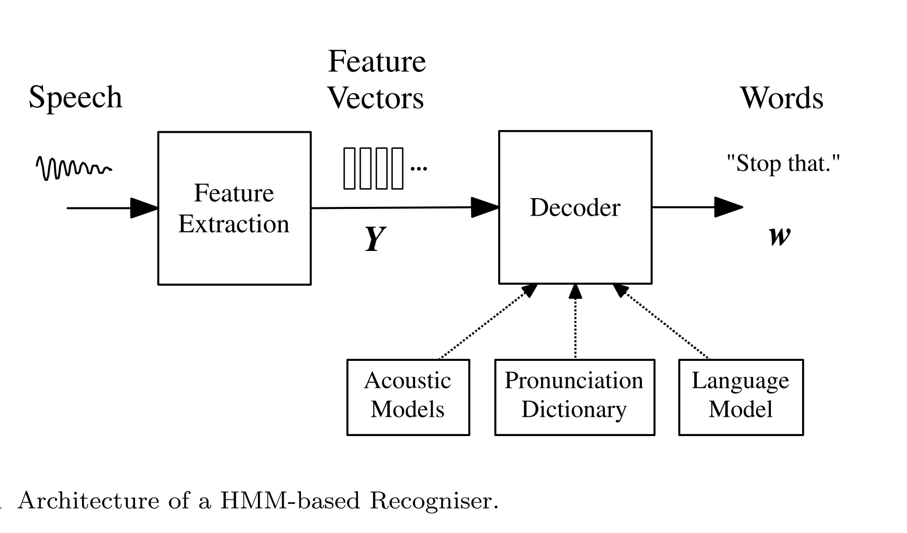
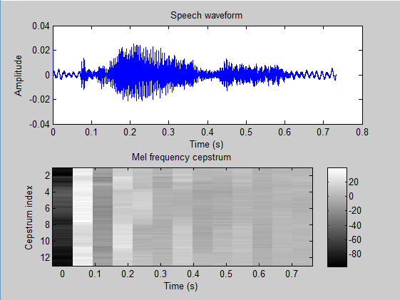

---
jupyter:
  jupytext:
    text_representation:
      extension: .Rmd
      format_name: rmarkdown
      format_version: '1.2'
      jupytext_version: 1.19.1
  kernelspec:
    display_name: Python 3 (ipykernel)
    language: python
    name: python3
---

```{r setup, include=FALSE}
library(reticulate)
use_python("/Users/Zhuanz/anaconda3/bin/python3.11", required = TRUE)
# or use your conda environment
use_condaenv("base", required = TRUE)
```

<!-- #region -->


Speech recognition is one of the most challenging tasks in natural language processing, and it is also a field that has developed rapidly in recent years. Automated Speech Recognition (ASR) can enable machines to understand the sounds made by humans (such as the languages of various countries). It has a wide range of applications, such as translation, human-computer interaction design and voice information retrieval (Spe Ech Information Retrieval, SIR) and so on. Modern ASR technology integrates signal processing, pattern recognition, network and communication into a unified framework. At present, the technologies adopted in ASR can be divided into three categories:

- Hidden Markov Model (HMM)

- Neural Networks (NN)

- Synthesis of the former two

In the past period of time, HMM has become the most successful voice recognition model in ASR. HMM is very effective for the analysis of time series. Almost all Large Vocabulary Continuous Speech Recognition (LVCSR) systems are based on HMM.

In this case, we first briefly describe the core framework of the LVCSR system based on HMM, and then use the HMM model (specifically Gaussian Mixture Model HMM, GMM-HMM) to specifically realise the lexical recognition of a single speaker. This case will not completely implement a voice recognition system. We just hope that through this case, readers can deeply understand some of the core ideas of HMM on voice recognition.

In addition to the method of implementing HMM in this case, the implementation of HMM can also use the Python toolkit hmmlearn.

### 1 Speech recognition framework


The whole HMM-based voice recognition system is divided into feature extraction and HMM-based decoding process.

### 1.1 Feature extraction

This stage extracts features that are convenient for voice recognition from the audio waveform, which is equivalent to the Encoding part. One of the simplest and most widely used methods is the analysis of mel-frequency cepstral coefficients (MFCCs).

Mel-frequency is proposed based on the auditory characteristics of the human ear (similar to the decibel concept), which has a nonlinear correspondence with the Hertz frequency. The inverse spectrum (cepstrum) is the spectrum obtained by the Fourier transform of a signal after logarithmic operation and then the Fourier inverse transformation. After extracting the characteristics of MFCCs, the waveform diagram is programmed with the mel inverse spectrum diagram, as follows:


The entire feature extraction process is the process of converting audio waveforms into fixed-length acoustic vectors $Y_{1:T} = y_1, \ldots, y_T$.

### 1.2 Decoding

In short, the decoding process is to find the word sequence $w_{1:L} = w_1, \ldots, w_L$ most likely to produce the acoustic vector $Y$, i.e., to find:

$$\hat{w} = \arg\max_{w}\{p(w|Y)\}$$

However, the discriminative $P(w|Y)$ is not easy to model directly. Therefore, it is necessary to convert the above problem into another equivalent form via Bayes' theorem:

$$\hat{w} = \arg\max_{w}\{p(Y|w)p(w)\}$$

The likelihood $p(Y|w)$ is determined by the acoustic model, and the prior probability $p(w)$ is determined by the language model. In the acoustic model, the basic unit of sound is the phone, such as /b/, /ae/, /t/. The core of the acoustic model is the HMM model. These phones are determined by a pronunciation dictionary, which determines the words composed of phones. See the HMM-based speech recognition framework diagram.

### 2 Data Exploration

The dataset used in this case (sourced from [Google Code project by Hakon Sandsmark](https://code.google.com/archive/p/hunpos/)) is single speaker data, not multispeaker data, so the robustness requirements on the model are not particularly high. The feature extraction method used in this case is not suitable for multispeaker speech recognition.

### 2.1 Word Content in Audio Files

Let's first look at what words are contained in the audio files in the folder:

```{python}
fpaths = [] # File path
labels = [] # The content of the words contained in each voice file
spoken = [] # List of words contained in all voice files
import os
for f in os.listdir('dataset/audio')[1:]: 
    for w in os.listdir('dataset/audio/' + f):
        fpaths.append('dataset/audio/' + f + '/' + w)
        labels.append(f)
        if f not in spoken:
            spoken.append(f)
print('Words spoken:', spoken)
```

In order to facilitate the subsequent analysis, we use a label vector all_labels to represent the word content of each voice file.

```{python}
from scipy.io import wavfile
import numpy as np

data = np.zeros((len(fpaths), 32000)) # Each behaviour has a voice sample, and each column is a feature of the sample.
maxsize = -1 # The maximum number of columns, the duration of each audio file is different, so it needs to be constantly changed in the loop.
for n,file in enumerate(fpaths):
    _, d = wavfile.read(file)
    data[n, :d.shape[0]] = d
    if d.shape[0] > maxsize:
        maxsize = d.shape[0]
data = data[:, :maxsize]

#Each sample file is one row in data, and has one entry in labels
print('Number of files total:', data.shape[0])
all_labels = np.zeros(data.shape[0])
for n, l in enumerate(set(labels)):
    all_labels[np.array([i for i, _ in enumerate(labels) if _ == l])] = n
print('data',data.shape)
print('Labels and label indices', all_labels)
```

There are a total of 90 files with 7 different words. Each word is read 15 times in total, and each time it is stored in a separate wav format voice file. The data set data has a total of 90 rows and 6,966 columns.


### 2.2 Visualisation of audio waveform

```{python}
import numpy as np
import matplotlib.pyplot as plt
import seaborn as sns # Import the seaborn package
sns.set_context("notebook",font_scale=1.3) # Notebook format, enlarge the horizontal and vertical coordinate mark
sns.set_palette('Set2') # Use Set2 for colour matching  

# Packages required for importing audio processing and DCT (discrete cosine transformation) conversion
import scipy.io.wavfile
from scipy.fftpack import dct

# Embedded mode
# %matplotlib inline 
# %config InlineBackend.figure_format = 'retina' # Retina high-definition display
```

In order to facilitate the subsequent drawing of spectrum diagrams, here we define a function of drawing `spectrum_plot`:

```{python}
"""
Function spectrum_plot(): Draw a spectrum diagram

Input parameter sequence: time series, in milliseconds (ms)

Output parameter amplitude: amplitude value
"""
def spectrum_plot(sequence,amplitude):
    plt.figure(figsize=(8,4))
    plt.plot(time_sequence,signal)
    plt.xlabel('miliseconds')
    plt.ylabel('Amplitude(signed 16 bit)')
```

Choose the file `./audio/apple/apple01.wav` file to observe its audio waveform.

```{python}
sample_rate, signal = scipy.io.wavfile.read('dataset/audio/apple/apple01.wav')  # import data
print ('sample_rate:',sample_rate,'Hz')
print ('signal time_interval:',1000*signal.shape[0]/float(sample_rate),'ms')
```

The whole audio sampling frequency is 8000 Hz, and the duration of this audio is 336.75 ms. Define the `time_sequence` to set the duration of the waveform, which needs to be converted into a time millisecond measure according to the sampling frequency calculation.

```{python}
time_sequence = [item*1000/float(sample_rate) for item in range(signal.shape[0])]
spectrum_plot(time_sequence,signal) 
```

### 3 Feature Extraction

There are two traditional audio feature extraction methods: one is simple resonance peak extraction, and the other is the widely used and proven effective Mel-frequency cepstral coefficients (MFCCs) extraction method. Currently, quite a few people have started attempting to use deep neural networks for feature extraction, which we will consider and elaborate on in other cases. The feature extraction method directly determines the performance of the speech recognition system. In this case, our focus is on the HMM model application part, so we use the simple resonance peak extraction method to extract features.

Now that we have imported the audio data into the array `signal`, we next need to extract features from the raw data. We use the simple frequency peak detection method to extract features.

### 3.1 Short-Time Fourier Transform STFT

To find the peaks in the frequency spectrum, we need to use a technique called Short Time Fourier Transform (STFT). STFT is a key technique in many Digital Signal Processing (DSP) processes, and is implemented by many efficient computational methods (refer to [numpy-based implementation](https://numpy.org), and matplotlib has a direct STFT implementation via the [specgram() function](https://matplotlib.org/stable/api/_as_gen/matplotlib.pyplot.specgram.html)). Since our data is relatively simple, we choose to implement our own STFT function.

The principle of this method is actually very simple: first, the audio will be divided into several small blocks, then a Fast Fourier Transform (FFT) is applied to each block, producing a two-dimensional FFT "image", which is what we commonly refer to as the spectrogram. Choosing different FFT sizes yields results at different frequency resolutions, and overlapping these windows allows us to control time resolution at the cost of increased data size.

Simply put, assuming the raw data x is a vector of length 20, if the FFT size is 10 and the overlap window is 5 (i.e., half of the FFT), then we will get the two-dimensional `STFT_x` result as follows (shown in pseudocode form):
```
STFT_X[0, :] = FFT(X[0:9])

STFT_X[1, :] = FFT(X[5:14])

STFT_X[2, :] = FFT(X[10:19])
```

This way we obtain 3 FFT frames from the raw data x. Next, we need to find the peaks from each row of `STFT_x`.

```{python}
import scipy

"""
Function stft(): realise short-time Fourier transform STFT

Input parameter x: raw data, ndarray;

Fftsize: FFT size, the default is 64

Overlap_pct: overlap window size (multiple of FFT size), default to 0.5

Output parameter raw[:,:(fftsize//2)]: two-dimensional STFT spectrum
"""
def stft(x, fftsize=64, overlap_pct=.5):
    hop = int(fftsize * (1 - overlap_pct))
    w = np.hanning(fftsize + 1)[:-1]  # Convert to Hanning window
    raw = np.array([np.fft.rfft(w * x[i:i + fftsize]) for i in range(0, len(x) - fftsize, hop)])
    return raw[:, :(fftsize // 2)]
```

After defining the STFT function, let's take a look at the spectrum diagram of one of the voices converted by STFT.

```{python}
plt.figure(figsize=(8,4))
plt.plot(data[0, :])
plt.title('Timeseries example for %s'%labels[0])
plt.xlim(0, 3000)
plt.xlabel('Time (samples)')
plt.ylabel('Amplitude (signed 16 bit)')
plt.figure()

# Draw STFT power spectrum PSD (power spectrum density)

# In order to avoid calculating log0, add 1 at the end
log_freq = 20 * np.log(np.abs(stft(data[0, :])) + 1) # stft结果取对数
print(log_freq.shape)
plt.imshow(log_freq, cmap='winter', interpolation=None)
plt.colorbar()
plt.xlabel('Freq (bin)')
plt.ylabel('Time (overlapped frames)')
plt.ylim(log_freq.shape[1])
plt.title('PSD of %s example'%labels[0])
```

### 3.2 Peak Extraction

With the STFT results, we can use a sliding window to extract peaks. The main steps of the algorithm are as follows:

1. Create a window of length x; in this example, we use a window size of 9;
2. Divide the window into three parts: left, center, and right. For a window of size 9, the format is LLLCCCRRR;
3. Apply statistical functions such as `mean`, `median`, `max`, `min` to each part of the window;
4. If the maximum statistical value in the center part (CCC) is greater than the maximum statistical values of the left (LLL) and right (RRR) parts, proceed to step 5, otherwise proceed to step 6;
5. If the maximum value of f(CCC) is at the exact center of the window, a frequency peak has been found — mark it and continue searching for the next peak; otherwise jump to step 6;
6. Slide the window to the next sample and repeat the above process, e.g. from `data[0:9]` to `data[1:10]`;
7. Once all the raw STFT data has been processed, a number of peaks can be detected. Sort them in descending order by value and take the top $N$ peaks; in this case $N = 6$.

We define a `peakfind` function to extract the peaks.

```{python}
from numpy.lib.stride_tricks import as_strided

"""
Function peakfind(): Peak detection of STFT

Input parameter x: STFT spectrum;

N_peaks: the final number of peaks selected

L_size: the size of the left half of the window, the default is 3

R_size: the size of the middle part of the window, the default is 3

C_size: the size of the right half of the window, the default is 3

F: The statistical function adopted for each part is defaulted to the mean np.mean

Output parameter heights: the height corresponding to the wave peak (amplitude)

Top[:n_peaks]: the frequency value of the previous n_peaks
"""
def peakfind(x, n_peaks, l_size=3, r_size=3, c_size=3, f=np.mean):
    win_size = l_size + r_size + c_size
    shape = x.shape[:-1] + (x.shape[-1] - win_size + 1, win_size)
    strides = x.strides + (x.strides[-1],)
    xs = as_strided(x, shape=shape, strides=strides)
    def is_peak(x):
        centered = (np.argmax(x) == l_size + int(c_size/2))
        l = x[:l_size]
        c = x[l_size:l_size + c_size]
        r = x[-r_size:]
        passes = np.max(c) > np.max([f(l), f(r)])
        if centered and passes:
            return np.max(c)
        else:
            return -1
    r = np.apply_along_axis(is_peak, 1, xs)
    top = np.argsort(r, None)[::-1]
    heights = r[top[:n_peaks]]
    top[top > -1] = top[top > -1] + l_size + int(c_size / 2.)
    return heights, top[:n_peaks]
```

Next, let's take a look at the peak detection results of the STFT spectrum under the same frame and different window sizes.

```{python}
plt.figure(figsize=(8,4))
plot_data = np.abs(stft(data[0, :]))[20,:]
values, locs = peakfind(plot_data, l_size=1,c_size=1,r_size=1,n_peaks=6)
fp_3 = locs[values > -1]
fv_3 = values[values > -1]
values, locs = peakfind(plot_data, l_size=3,c_size=3,r_size=3,n_peaks=6)
fp_9 = locs[values > -1]
fv_9 = values[values > -1]
f1 = plt.plot(plot_data)
f2 = plt.plot(fp_3, fv_3, '<')
f3 = plt.plot(fp_9, fv_9, '>')
plt.legend(['stft data','window size 3','window size 9'])
plt.xlabel('Frequency (bins)')
plt.ylabel('Amplitude')
plt.title('Peak location example')
```

We observed that when the window is 9, there are only 3 peaks that meet the conditions, and the complete 6 peaks cannot be taken. So our peak search is not perfect. Because for FFT with a size of 64, the window with a size of 9 is relatively large, and it is easy to filter out some peaks. This has some negative effects on subsequent models. In order to find more peaks, too large FFT can be done, but under the same time resolution, the effect of the subsequent model will also be negatively affected. Therefore, some advanced feature extraction methods are needed, such as MFCCs, which we will not deal with here.

In the last part of feature extraction, we extract the peak data of all voice samples as the input of the subsequent GMM-HMM model.

```{python}
all_obs = []
for i in range(data.shape[0]):
    d = np.abs(stft(data[i, :]))
    n_dim = 6
    obs = np.zeros((n_dim, d.shape[0]))
    for r in range(d.shape[0]):
        _, t = peakfind(d[r, :], n_peaks=n_dim)
        obs[:, r] = t.copy()
    if i % 10 == 0:
        print("Processed obs %s" % i)
    all_obs.append(obs)
    
all_obs = np.atleast_3d(all_obs)
print (all_obs.shape)
```

The final result is a 90 × 6 × 216 three-dimensional array, where each audio waveform ends up with 216 overlapping frames, and each frame is described by the frequencies corresponding to the top 6 peak values.

## 4 GMM-HMM Model Decoding

After extracting the spectral peak features of the audio waveforms, we can begin the decoding part. This part requires the GMM-HMM model, which is a very complex algorithm. You can refer to [Brown's summary](https://brown.edu) and [Moore's summary](https://moore.edu).

Our implemented model does not include the Viterbi backtracking part, because here we only care about speech classification, and the Baum-Welch and forward-backward parts of the model are already sufficient for our needs.

The HMM model is mainly used in three scenarios:

1. State probability estimation $P(S|O)$. If there is prior information about the meaning of the states, this method will be very effective;
2. Path estimation. Given an observed time series, what is the most probable "state path" — this is not covered in this case;
3. Maximum likelihood estimation $P(O|\lambda)$. By maximizing the probability of the observed values under certain parameter conditions, the optimal parameters $\lambda$ of the HMM are trained. This case mainly adopts this method.

We use the Baum-Welch algorithm to train the HMM model. At the same time, this part uses scipy 0.14 for multivariate normal density computation. Next, we directly define the GMM-HMM model class `GmmHmm`, and then the forward-backward algorithm, EM process, model training, prediction, and other procedures are all encapsulated in the class `GmmHmm` through defined functions.

```{python}
import scipy.stats as st
import numpy as np

class GmmHmm:
    
    def __init__(self, n_states):
        self.n_states = n_states
        self.random_state = np.random.RandomState(0)
        
        # Random initialisation
        self.prior = self._normalize(self.random_state.rand(self.n_states, 1))
        self.A = self._stochasticize(self.random_state.rand(self.n_states, self.n_states))
        
        self.mu = None
        self.covs = None
        self.n_dims = None
           
    def _forward(self, B):
        log_likelihood = 0.
        T = B.shape[1]
        alpha = np.zeros(B.shape)
        for t in range(T):
            if t == 0:
                alpha[:, t] = B[:, t] * self.prior.ravel()
            else:
                alpha[:, t] = B[:, t] * np.dot(self.A.T, alpha[:, t - 1])
         
            alpha_sum = np.sum(alpha[:, t])
            alpha[:, t] /= alpha_sum
            log_likelihood = log_likelihood + np.log(alpha_sum)
        return log_likelihood, alpha
    
    def _backward(self, B):
        T = B.shape[1]
        beta = np.zeros(B.shape);
           
        beta[:, -1] = np.ones(B.shape[0])
            
        for t in range(T - 1)[::-1]:
            beta[:, t] = np.dot(self.A, (B[:, t + 1] * beta[:, t + 1]))
            beta[:, t] /= np.sum(beta[:, t])
        return beta
    
    def _state_likelihood(self, obs):
        obs = np.atleast_2d(obs)
        B = np.zeros((self.n_states, obs.shape[1]))
        for s in range(self.n_states):
            #N This part requires Scipy above version 0.14.
            np.random.seed(self.random_state.randint(1))
            B[s, :] = st.multivariate_normal.pdf(
                obs.T, mean=self.mu[:, s].T, cov=self.covs[:, :, s].T)
        return B
    
    def _normalize(self, x):
        return (x + (x == 0)) / np.sum(x)
    
    def _stochasticize(self, x):
        return (x + (x == 0)) / np.sum(x, axis=1)
    
    def _em_init(self, obs):
        
        if self.n_dims is None:
            self.n_dims = obs.shape[0]
        if self.mu is None:
            subset = self.random_state.choice(np.arange(self.n_dims), size=self.n_states, replace=False)
            self.mu = obs[:, subset]
        if self.covs is None:
            self.covs = np.zeros((self.n_dims, self.n_dims, self.n_states))
            self.covs += np.diag(np.diag(np.cov(obs)))[:, :, None]
        return self
    
    def _em_step(self, obs): 
        obs = np.atleast_2d(obs)
        B = self._state_likelihood(obs)
        T = obs.shape[1]
        
        log_likelihood, alpha = self._forward(B)
        beta = self._backward(B)
        
        xi_sum = np.zeros((self.n_states, self.n_states))
        gamma = np.zeros((self.n_states, T))
        
        for t in range(T - 1):
            partial_sum = self.A * np.dot(alpha[:, t], (beta[:, t] * B[:, t + 1]).T)
            xi_sum += self._normalize(partial_sum)
            partial_g = alpha[:, t] * beta[:, t]
            gamma[:, t] = self._normalize(partial_g)
              
        partial_g = alpha[:, -1] * beta[:, -1]
        gamma[:, -1] = self._normalize(partial_g)
        
        expected_prior = gamma[:, 0]
        expected_A = self._stochasticize(xi_sum)
        
        expected_mu = np.zeros((self.n_dims, self.n_states))
        expected_covs = np.zeros((self.n_dims, self.n_dims, self.n_states))
        
        gamma_state_sum = np.sum(gamma, axis=1)
        #Before the division operation, change 0 to 1.
        gamma_state_sum = gamma_state_sum + (gamma_state_sum == 0)
        
        for s in range(self.n_states):
            gamma_obs = obs * gamma[s, :]
            expected_mu[:, s] = np.sum(gamma_obs, axis=1) / gamma_state_sum[s]
            partial_covs = np.dot(gamma_obs, obs.T) / gamma_state_sum[s] - np.dot(expected_mu[:, s], expected_mu[:, s].T)
            # 对称
            partial_covs = np.triu(partial_covs) + np.triu(partial_covs).T - np.diag(partial_covs)
        
        #Add diagonal elements to ensure semi-determinity
        expected_covs += .01 * np.eye(self.n_dims)[:, :, None]
        
        self.prior = expected_prior
        self.mu = expected_mu
        self.covs = expected_covs
        self.A = expected_A
        return log_likelihood
    
    def fit(self, obs, n_iter=15):
        # Obj supports 2D or 3D arrays

        # The form of 2D array is n_features, n_dims

        # The form of 3D array is n_examples, n_features, n_dims

        # For example, if a voice fragment contains 6 characteristics and consists of 105 different samples

        # So this obj array is three-dimensional, the size is (105,6,X), where X is the number of frames.

        # For data containing only one sample, obj size is (6,X)
        if len(obs.shape) == 2:
            for i in range(n_iter):
                self._em_init(obs)
                log_likelihood = self._em_step(obs)
        elif len(obs.shape) == 3:
            count = obs.shape[0]
            for n in range(count):
                for i in range(n_iter):
                    self._em_init(obs[n, :, :])
                    log_likelihood = self._em_step(obs[n, :, :])
        return self
    
    def transform(self, obs):
        # obj supports 2D or 3D arrays

        # The form of 2D array is n_features, n_dims

        # The form of 3D array is n_examples, n_features, n_dims

        # For example, if a voice fragment contains 6 characteristics and consists of 105 different samples

        # So this obj array is three-dimensional, the size is (105,6,X), where X is the number of frames.

        # For data containing only one sample, obj size is (6,X)
        if len(obs.shape) == 2:
            B = self._state_likelihood(obs)
            log_likelihood, _ = self._forward(B)
            return log_likelihood
        elif len(obs.shape) == 3:
            count = obs.shape[0]
            out = np.zeros((count,))
            for n in range(count):
                B = self._state_likelihood(obs[n, :, :])
                log_likelihood, _ = self._forward(B)
                out[n] = log_likelihood
            return out
```

Next, we choose two (4,40) arrays and put them into the class for training.

```{python}
if __name__ == "__main__":
    rstate = np.random.RandomState(0)
    t1 = np.ones((4, 40)) + .001 * rstate.rand(4, 40)
    t1 /= t1.sum(axis=0) # NORMALISATION
    t2 = rstate.rand(*t1.shape)
    t2 /= t2.sum(axis=0) # NORMALISATION

    m1 = GmmHmm(2)
    m1.fit(t1)
    m2 = GmmHmm(2)
    m2.fit(t2)
    
    m1t1 = m1.transform(t1)
    m2t1 = m2.transform(t1)
    print("Likelihoods for test set 1")
    print("M1:", m1t1)
    print("M2:", m2t1)
    print("Prediction for test set 1")
    print("Model", np.argmax([m1t1, m2t1]) + 1)
    print()
    
    m1t2 = m1.transform(t2)
    m2t2 = m2.transform(t2)
    print("Likelihoods for test set 2")
    print("M1:", m1t2)
    print("M2:", m2t2)
    print("Prediction for test set 2")
    print("Model", np.argmax([m1t2, m2t2]) + 1)
```

For sample t1, it better fits model M1; for sample t2, it better fits model M2.

### 5 Speech Recognition Model Training and Prediction

Now all the preparation work is complete, and all that remains is to train the model using actual audio samples and make predictions.

### 5.1 Train/Test Split

Next, we use 80% of the original 105 samples as the training set and 20% as the test set for model training and prediction. To ensure that the word class distribution of samples in the test set and training set is balanced, we need to pass the label `all_labels` of each sample's word to the `stratify` parameter when splitting the dataset.

```{python}
from sklearn.model_selection import train_test_split
X_train, X_test, y_train, y_test = train_test_split(all_obs,
                                                    all_labels,
                                                    train_size=0.8,
                                                    test_size=0.2,
                                                    random_state =666,
                                                    stratify=all_labels)

# Since the result of HMM is probability, we need to normalise the characteristics.
for n,i in enumerate(all_obs):
    all_obs[n] /= all_obs[n].sum(axis=0)

print('Size of training matrix:', X_train.shape)
print('Size of testing matrix:', X_test.shape)
```

In order to predict the words in each voice, we need to train 7 independent GMM-HMM models, each corresponding to one word. Then we extract the characteristics in the test voice sample, "feed" to 7 models, and select the word corresponding to the GMM-HMM with the highest output similarity as the prediction results.

```{python}
ys = set(all_labels)
ms = [GmmHmm(6) for y in ys]
_ = [m.fit(X_train[y_train == y, :, :]) for m, y in zip(ms, ys)]
ps = [m.transform(X_test) for m in ms]
res = np.vstack(ps)
predicted_labels = np.argmax(res, axis=0)
missed = (predicted_labels != y_test)
print('Test accuracy: %.2f percent' % (100 * (1 - np.mean(missed))))
```

It seems that the accuracy rate is relatively high, but it is not very good. After all, this is a simple single-sound source task. Let's take a look at the situation of the confusion matrix:

```{python}
from sklearn.metrics import confusion_matrix

cm = confusion_matrix(y_test, predicted_labels)
f,ax = plt.subplots(figsize=(8,6))
sns.heatmap(cm, 
            annot=True,
            cmap='summer',
            linewidths=1.3)
ax.set_xticklabels(spoken)
ax.set_yticklabels(spoken,rotation='horizontal')
plt.title('Confusion matrix, single speaker')
plt.ylabel('True label')
plt.xlabel('Predicted label')
```

### 6 Summary

After arduous exploration, we can finally completely extract the peak characteristics of the voice waveform and use them for the training of the GMM-HMM model, and finally realise the recognition of single-sound source voice. You can try to record the voice file of several words with your own voice, and then use the steps of this case to generate a self-identification. The voice recognition model of your own voice. In the future, we can try to use MFCCs or deep neural networks to deal with the problem of voice recognition!


