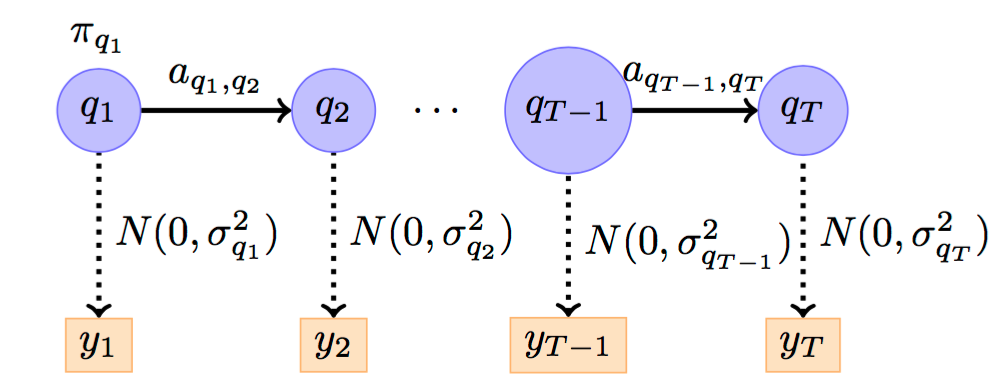

---
jupyter:
  jupytext:
    text_representation:
      extension: .Rmd
      format_name: rmarkdown
      format_version: '1.2'
      jupytext_version: 1.19.1
  kernelspec:
    display_name: Python 3 (ipykernel)
    language: python
    name: python3
---

```{r setup, include=FALSE}
library(reticulate)
use_python("/Users/Zhuanz/anaconda3/bin/python3.11", required = TRUE)
# or use your conda environment
use_condaenv("base", required = TRUE)
```

<!-- #region -->
### Package version information

```{python}
# !pip freeze | grep pandas
# !pip freeze | grep numpy
# !pip freeze | grep hmmlearn
# !pip freeze | grep matplotlib
```

### Data preprocessing
First of all, we load the third-party library required by the case and block the warning information generated by the running code.


```{python}
import warnings
import numpy as np
import pandas as pd
import matplotlib.pyplot as plt
from matplotlib import cm
from scipy.stats import norm
warnings.filterwarnings("ignore")
```

Use `Pandas'` `read_csv` function to read the data and save it in the variable `stock_data`.

```{python}
stock_data = pd.read_csv('dataset/stock_index.csv')
stock_data.head()
```

```{python}
print (u'The size of the data set stock_data is： ', stock_data.shape)
```

Then, we check the information of each feature of `stock_data`, including the data type of the feature, and whether there are missing values, etc.

```{python}
stock_data.info()
```

Judging from the information returned by `info()`, the data set `stock_data` has no missing value, and the data type of the characteristic time is `object`, specifically the string type. Next, we convert the type of characteristic time from the character type to the `datetime` type.

```{python}
stock_data['date'] = pd.to_datetime(stock_data['date'])
stock_data.head()
```

```{python}
stock_data.info()
```

We set the row index of `stock_data` to `stock['date']` so that we can slice data according to different dates.

```{python}
stock_data.index = stock_data['date']
```

```{python}
stock_data.head()
```

For example, when we query the data after February 2017, we need to use `Python's` built-in date library `datetime`.

```{python}
import datetime as dt
stock_data[:dt.datetime(2017, 1, 31)]
```

### Data visualisation
We try to use a line chart to show the opening `stock_data[open]` and closing `stock_data[closes]` of `stock_data`.

```{python}
plt.figure() 
stock_data['open'].plot(color = 'r') 
stock_data['close'].plot(color = 'b')

plt.legend(['open price', 'close price'], loc='upper right')

plt.title('Stock Index Trend') 
plt.show()
```

Then, let's try to draw a distribution map of the rise and fall.

```{python}
returns = stock_data['p_change']
[n, bins, patches] = plt.hist(returns, 100)
mu = np.mean(returns)
sigma = np.std(returns)
x = norm.pdf(bins, mu, sigma)
plt.plot(bins, x, color='blue', lw=2)
plt.show()
```

### Gaussian HMM
The hidden Markov model is a simple Bayesian network model, which is a kind of directed graph model.


Next, we examine the changes at market close, i.e. the difference between stock_data['close'] on two consecutive days. To align the data, the date and volume features also need to be shifted forward by one day, so that len(close) = stock_data['close'].shape[0] - 1


```{python}
diff = np.diff(stock_data['close'])

dates = stock_data['date'][1:]
close = stock_data['close'][1:]
volume = stock_data['volume'][1:]
```

In order to facilitate visualisation, we select two indicators of the rise and fall of the index and the turnover here for investigation, that is, the data set of the input HMM model is X, and the size is (728, 2)

```{python}
X = np.column_stack([diff, volume])
X.shape
```

```{python}
from hmmlearn.hmm import GaussianHMM

# Create a Gaussian MMM model
model = GaussianHMM(n_components=4, covariance_type="diag", n_iter=1000)

## Use data set X to train the model
model.fit(X)

# Predict the optimal implicit state sequence
hidden_states = model.predict(X)
```

After the model training is completed, we check the parameters of the response, such as the transfer matrix and the distribution parameters of each implicit state.

```{python}
print (u"The transfer matrix is： ")
print (model.transmat_)
print ('')

print (u"The mean and variance of each implicit state distribution： ")

for number in range(model.n_components):
    print (u"{0}th Implicit state".format(number))
    print (u"Mean value： ", model.means_[number])
    print (u"Variance： ", np.diag(model.covars_[number]))
    print ('')

plt.figure(figsize=(50,10), dpi = 80)
fig, axs = plt.subplots(model.n_components, sharex=True, sharey=True)
colours = cm.rainbow(np.linspace(0, 1, model.n_components))
for i, (ax, colour) in enumerate(zip(axs, colours)):
    # Use fancy indexing to plot data in each state.
    
    mask = hidden_states == i
    ax.plot_date(dates[mask], close[mask], ".-", c=colour)
    ax.set_title(u"{0}th hidden state".format(i))

    # Format the ticks.
    #ax.xaxis.set_major_locator(YearLocator())
    #ax.xaxis.set_minor_locator(MonthLocator())
    fig.tight_layout() 
    ax.grid(True)

plt.show()
```


