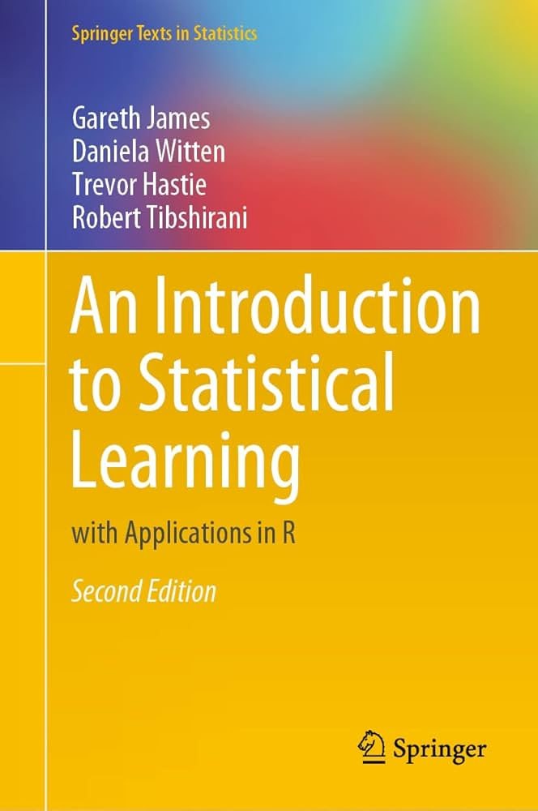
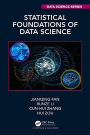
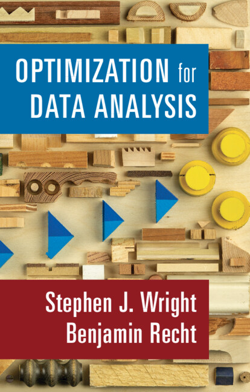
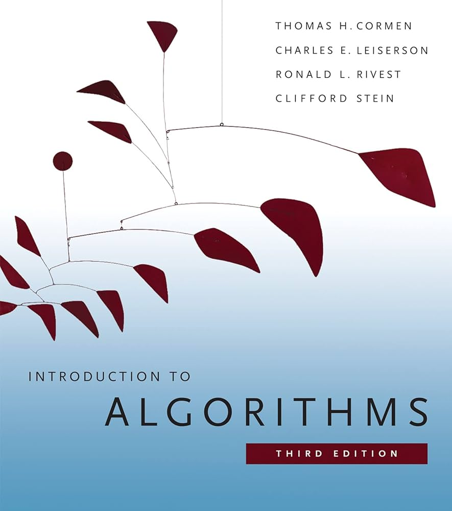

{width=25%} 

## Professional

I’m an enthusiastic professional data scientist with over ten years of experience collaborating on data analysis with diverse partners in industry and tech.  My previous work experiences include predicting the sales of JD.com and analysing the logisitc data. I am a member of Irish Statistical Association.    

## Personal

I am single and currently living with my parents.

## Contact

Want to chat?  Go ahead, pipe up!  Feel free to contact me on [email](mailto:longxiangwu@outlook.com){target="_blank"}, or [LinkedIn](www.linkedin.com/in/longxiang-wu-003506106){target="_blank"}. I hope to hear from you!

## Books I am reading

:::: {style="display: flex; gap: 10px; align-items: flex-start;"}
::: {style="flex-shrink: 0;"}
{style="height: 300px; width: auto;"}
:::
::: {style="flex-shrink: 0;"}
{style="height: 300px; width: auto;"}
:::
::: {style="flex-shrink: 0;"}
{style="height: 300px; width: auto;"}
:::
::: {style="flex-shrink: 0;"}
{style="height: 300px; width: auto;"}
:::
::::

