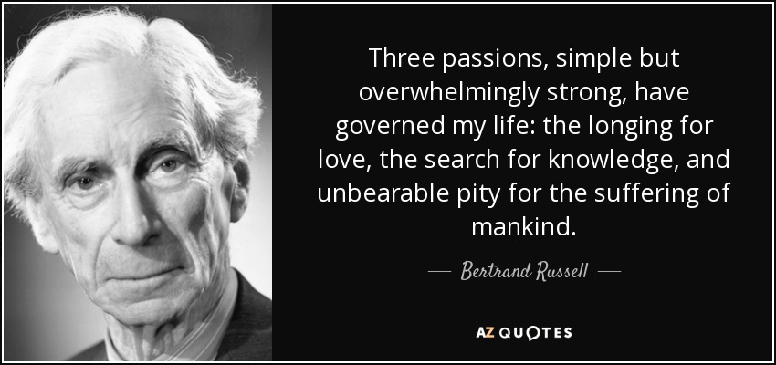

:::: {style="display: flex; flex-wrap: wrap; align-items: center; gap: 30px; margin-bottom: 2rem; padding: 2rem 0; border-bottom: 1px solid #eaeaea;"}

::: {style="flex: 0 0 auto;"}
{style="width: 180px; height: 180px; object-fit: cover; border-radius: 50%; box-shadow: 0 8px 16px rgba(0,0,0,0.15);" alt="Longxiang Wu"}
:::

::: {style="flex: 1 1 300px;"}
<h2 style="margin-top: 0; font-size: 2.2rem; color: #2c3e50;">Hello/Enchanté/Hola.</h2>

  I am an enthusiastic data scientist with over ten years of experience working with a variety of partners in the technology and industry sectors. My responsibilities encompass the entire data pipeline, from exploratory analysis to production-ready predictive models.

  <a href="mailto:longxiangwu@outlook.com" style="display: inline-block; padding: 10px 20px; background-color: #0072b1; color: white; border-radius: 8px; text-decoration: none; font-weight: 500; box-shadow: 0 4px 6px rgba(0,114,177,0.2); transition: transform 0.2s;" onmouseover="this.style.transform='translateY(-2px)'" onmouseout="this.style.transform='translateY(0)'">✉️ Email Me</a>
  <a href="https://www.linkedin.com/in/longxiang-wu-003506106" target="_blank" style="display: inline-block; padding: 10px 20px; background-color: white; color: #0072b1; border: 1.5px solid #0072b1; border-radius: 8px; text-decoration: none; font-weight: 500; box-shadow: 0 4px 6px rgba(0,0,0,0.05); transition: transform 0.2s;" onmouseover="this.style.transform='translateY(-2px)'" onmouseout="this.style.transform='translateY(0)'">🔗 LinkedIn</a>

:::
::::

## 💼 Professional

Notable projects include the development of **sales forecasting models** for JD.com and conducting in-depth **logistics data analysis** to enhance operational efficiency. I take pride in turning complex datasets into actionable business strategies and impactful solutions.

I am also a proud member of the **Irish Statistical Association**.

 

## 🌱 Personal

I am currently in a stable and fulfilling stage of life, living with my family and fully committed to both personal growth and professional development. The support and perspective offered by my family environment provide me with balance and inform my work approach, allowing me to operate with patience, care, and a long-term outlook. 

Beyond my professional interests in data and technology, I place a high value on building meaningful relationships, pursuing continuous learning, and bringing a holistic and authentic perspective to my work. I believe that the most impactful contributions come from individuals who are fully engaged both personally and professionally.

 

## 💭 Inspirations & Quotes

*Thinkers who have profoundly influenced my perspective.*

:::: {style="display: grid; grid-template-columns: repeat(auto-fit, minmax(200px, 1fr)); gap: 24px; align-items: start; margin-top: 1.5rem; margin-bottom: 3rem;"}
{style="width: 100%; border-radius: 12px; box-shadow: 0 6px 12px rgba(0,0,0,0.1); transition: transform 0.3s ease;" onmouseover="this.style.transform='scale(1.03)'" onmouseout="this.style.transform='scale(1)'"}
{style="width: 100%; border-radius: 12px; box-shadow: 0 6px 12px rgba(0,0,0,0.1); transition: transform 0.3s ease;" onmouseover="this.style.transform='scale(1.03)'" onmouseout="this.style.transform='scale(1)'"}
{style="width: 100%; border-radius: 12px; box-shadow: 0 6px 12px rgba(0,0,0,0.1); transition: transform 0.3s ease;" onmouseover="this.style.transform='scale(1.03)'" onmouseout="this.style.transform='scale(1)'"}
::::

## 🎨 Art Appreciation

*A selection of my favorite paintings by Claude Monet, bringing a touch of tranquility.*

:::: {style="display: grid; grid-template-columns: repeat(auto-fit, minmax(250px, 1fr)); gap: 24px; align-items: center; margin-top: 1.5rem; margin-bottom: 3rem;"}
{style="width: 100%; border-radius: 12px; box-shadow: 0 6px 12px rgba(0,0,0,0.1); transition: transform 0.3s ease;" onmouseover="this.style.transform='scale(1.03)'" onmouseout="this.style.transform='scale(1)'"}
{style="width: 100%; border-radius: 12px; box-shadow: 0 6px 12px rgba(0,0,0,0.1); transition: transform 0.3s ease;" onmouseover="this.style.transform='scale(1.03)'" onmouseout="this.style.transform='scale(1)'"}
{style="width: 100%; border-radius: 12px; box-shadow: 0 6px 12px rgba(0,0,0,0.1); transition: transform 0.3s ease;" onmouseover="this.style.transform='scale(1.03)'" onmouseout="this.style.transform='scale(1)'"}
{style="width: 100%; border-radius: 12px; box-shadow: 0 6px 12px rgba(0,0,0,0.1); transition: transform 0.3s ease;" onmouseover="this.style.transform='scale(1.03)'" onmouseout="this.style.transform='scale(1)'"}
{style="width: 100%; border-radius: 12px; box-shadow: 0 6px 12px rgba(0,0,0,0.1); transition: transform 0.3s ease;" onmouseover="this.style.transform='scale(1.03)'" onmouseout="this.style.transform='scale(1)'"}
{style="width: 100%; border-radius: 12px; box-shadow: 0 6px 12px rgba(0,0,0,0.1); transition: transform 0.3s ease;" onmouseover="this.style.transform='scale(1.03)'" onmouseout="this.style.transform='scale(1)'"}
::::

  <h3 style="color: #2c3e50; margin-top: 0;">Let's Connect</h3>
  
Want to chat about data, tech, or art? I'd love to hear from you!

  <a href="mailto:longxiangwu@outlook.com" style="display: inline-block; padding: 12px 28px; background-color: #2c3e50; color: white; border-radius: 30px; text-decoration: none; font-weight: bold; margin-top: 15px; box-shadow: 0 4px 10px rgba(0,0,0,0.1); transition: transform 0.2s, background-color 0.2s;" onmouseover="this.style.backgroundColor='#1a252f'; this.style.transform='translateY(-2px)'" onmouseout="this.style.backgroundColor='#2c3e50'; this.style.transform='translateY(0)'">Drop me an Email</a>

